# Menú desplegable por eventos de puntero y sistema de temporadas calendarizadas

Iglesia Agua de Vida — documentación técnica y evidencias de la implementación.

## 1. Objetivo

1. Convertir el menú de navegación existente (`app-navbar`) en un menú **desplegable**
   que se activa con **eventos de puntero** (`click`, que cubre tanto mouse como touch)
   en lugar de `:hover` — necesario porque `:hover` no funciona de forma confiable en
   dispositivos táctiles.
2. Agregar un **menú de hamburguesa** para pantallas móviles, ya que el menú anterior
   simplemente ocultaba los enlaces (`display:none`) sin ofrecer ninguna alternativa
   de navegación en mobile.
3. Implementar un **evento basado en periodo/calendario** que cambie la interfaz
   (fondo del navbar/footer y banners) según la temporada del año, con la opción de
   que el usuario la seleccione manualmente desde el footer.

---

## 2. Menú desplegable

### 2.1 Estructura

Cada elemento del menú principal (`INICIO`, `PREDICAS`, `AVISOS`, `CONTACTO`) tiene:

- Un enlace de texto que navega directamente a la página (comportamiento original,
  sin romper nada existente).
- Un botón con flecha (`chevron`) que **activa por click/tap** un submenú:

| Menú principal | Submenú |
|---|---|
| **INICIO** | Horarios de Servicio, Información General |
| **PREDICAS** | Ver todas + los 12 meses del año |
| **AVISOS** | Ver todos + los 12 meses del año |
| **CONTACTO** | Ubicación, Redes Sociales, Enviar Mensaje |

Archivos relevantes:
- `src/app/core/navbar/navbar.ts` — arreglo `menuItems`, lógica de apertura/cierre.
- `src/app/core/navbar/navbar.html` — plantilla del `.dropdown-panel` y del drawer móvil.
- `src/app/core/navbar/navbar.css` — estilos del submenú y del drawer.
- `src/app/shared/meses.ts` — lista de meses reutilizada por el navbar y por el
  filtrado de Avisos/Prédicas.

### 2.2 Por qué "evento de puntero" y no `:hover`

El toggle se hace con `(click)="toggleDropdown(item.label, $event)"`, y se cierra
con un `@HostListener('document:click')`. Esto asegura que el mismo menú funcione
igual con mouse (desktop) y con touch (celular/tablet), y que además navegue
correctamente vía Angular Router (`routerLink`, `queryParams`, `fragment`).

### 2.3 Filtro por mes en Avisos y Prédicas

Los submenús de `AVISOS` y `PREDICAS` navegan con un query param, por ejemplo
`/avisos?mes=3`. Las páginas correspondientes (`avisos.ts`, `predicas.ts`) leen ese
parámetro con `ActivatedRoute.queryParamMap` y filtran los datos mostrados, con un
enlace "Ver todos" para quitar el filtro.

### 2.4 Anclas en Inicio y Contacto

Se agregaron `id="horarios"`, `id="informacion"` (Home) e `id="mapa"`, `id="social"`,
`id="formulario"` (Contacto). El router se configuró con scroll a fragmentos:

```ts
// app.config.ts
provideRouter(routes, withInMemoryScrolling({
  scrollPositionRestoration: 'enabled',
  anchorScrolling: 'enabled'
}))
```

### 2.5 Menú de hamburguesa (móvil)

Antes: en pantallas ≤768px, `.links { display: none; }` dejaba el sitio **sin
navegación posible**. Ahora aparece un botón de hamburguesa que abre un drawer
lateral con acordeón — mismos datos que el menú de escritorio (`menuItems`), pero
presentados como lista expandible.

---

## 3. Sistema de temporadas calendarizadas

### 3.1 Cómo funciona

`src/app/services/theme.service.ts` expone una signal `theme` con tres valores
posibles: `'normal' | 'navidad' | 'independencia'`.

- **Automático por calendario**: si el usuario no ha elegido nada manualmente, el
  servicio revisa el mes actual (`new Date().getMonth()`): diciembre activa el tema
  `navidad`, septiembre activa `independencia`, cualquier otro mes usa `normal`.
- **Selección manual**: los 3 botones del footer (`🔷 Normal`, `🎄 Navideño`,
  `🇲🇽 Septiembre`) llaman a `themeService.setTheme(...)`, que persiste la elección
  en `localStorage` para que se mantenga entre recargas.
- El servicio aplica una clase (`theme-normal`, `theme-navidad`,
  `theme-independencia`) al `<body>`, y `src/styles.css` define las reglas globales
  que recolorean navbar, footer y botones según el tema activo.

### 3.2 Componente de overlay estacional

`src/app/components/seasonal-overlay/` añade, solo cuando el tema no es `normal`:

- Un **banner** superior con el mensaje de temporada (colores navideños o los de
  la bandera de México para independencia).
- Copos de nieve animados (`❄`, generados dinámicamente y sin librerías externas)
  cuando el tema es `navidad`.

### 3.3 Tema "Normal"

El botón "Normal" restaura exactamente el aspecto original del sitio (azul
`#225574` en navbar, gris oscuro `#0f172a` en footer), sin banner ni animaciones.

---

## 4. Evidencias (capturas de pantalla)

Todas las capturas se generaron con Playwright contra `ng serve` en
`http://localhost:4300`, sin errores de consola.

### 4.1 Menú desplegable — Escritorio

**Página de inicio, tema normal:**

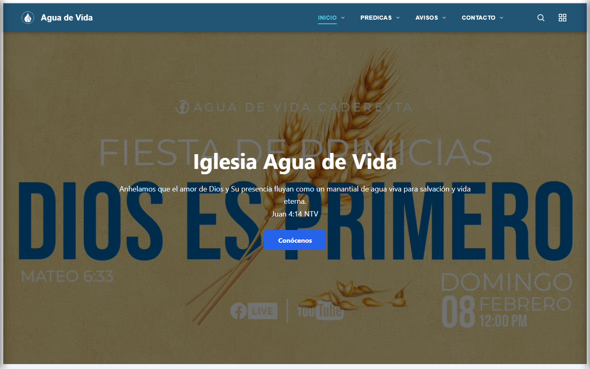

**Submenú de AVISOS desplegado (activado por click):**

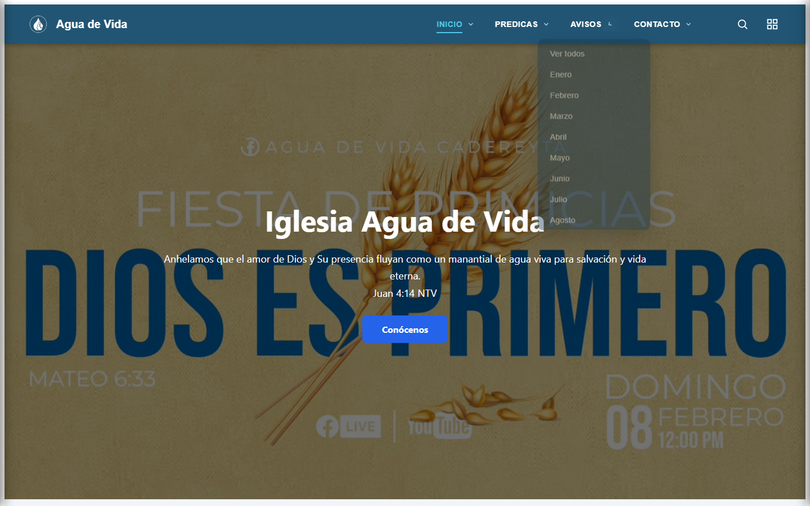

**Filtro por mes: Avisos → Marzo (`/avisos?mes=3`):**

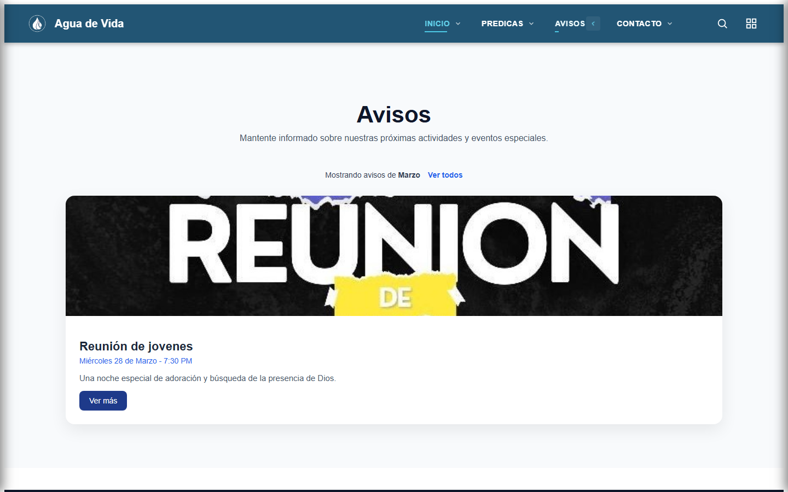

**Submenú de PREDICAS desplegado:**

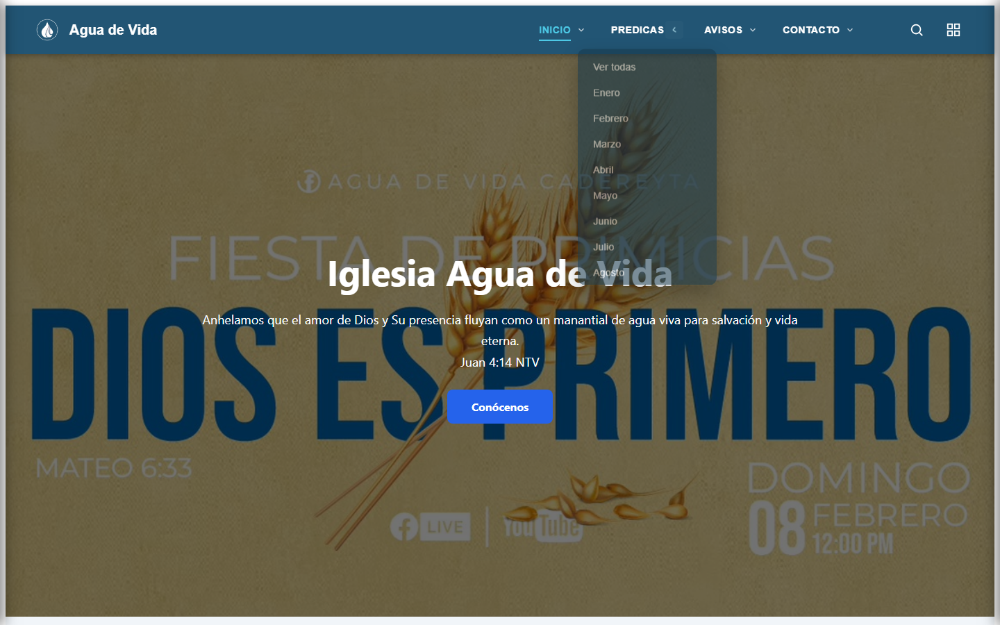

**Submenú de CONTACTO desplegado:**

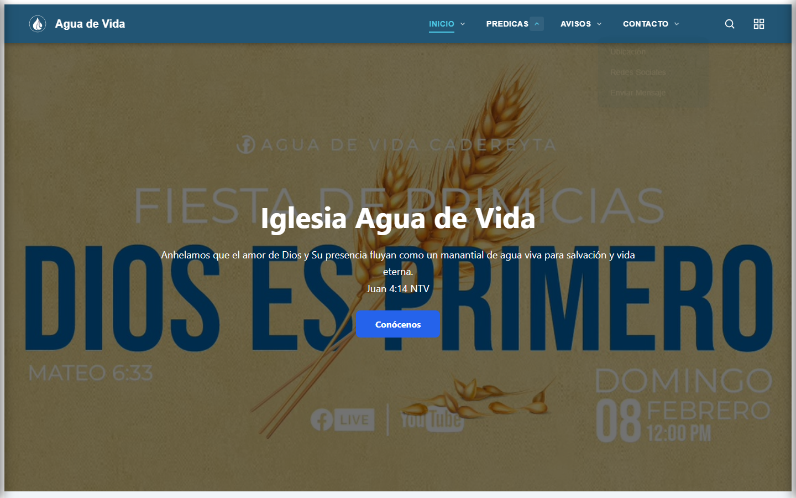

**Navegación por ancla: Contacto → Ubicación (scroll automático al mapa):**

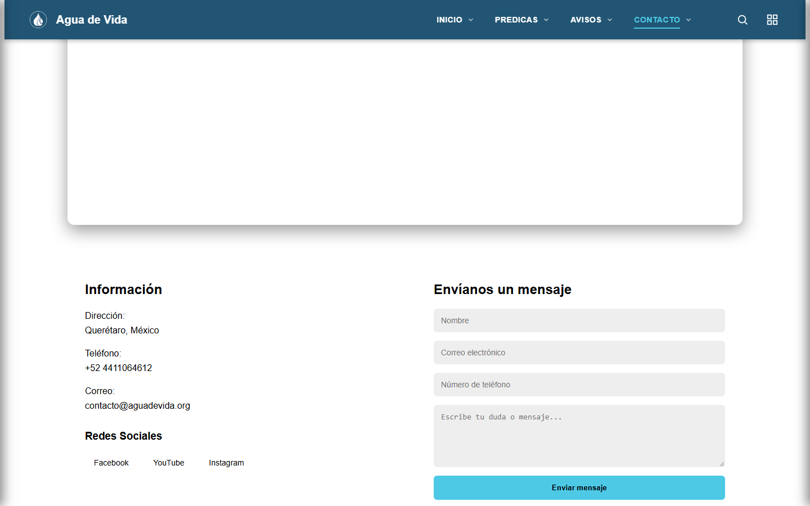

**Navegación por ancla: Inicio → Horarios de Servicio:**

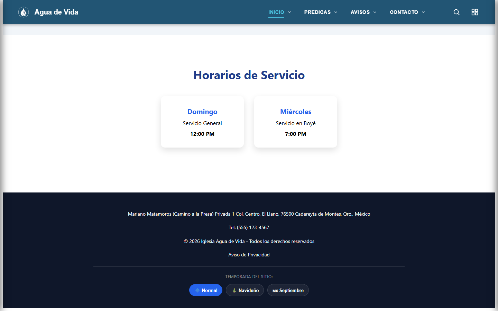

### 4.2 Menú de hamburguesa — Móvil (390×844)

**Vista móvil con botón de hamburguesa visible:**

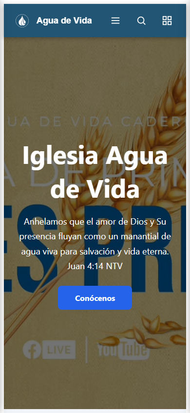

**Drawer de navegación abierto (acordeón):**

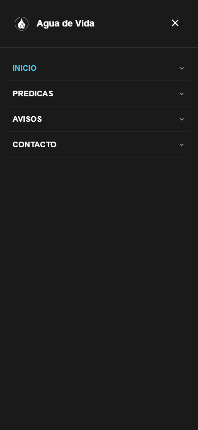

**Submenú "AVISOS" expandido dentro del drawer (los 12 meses):**

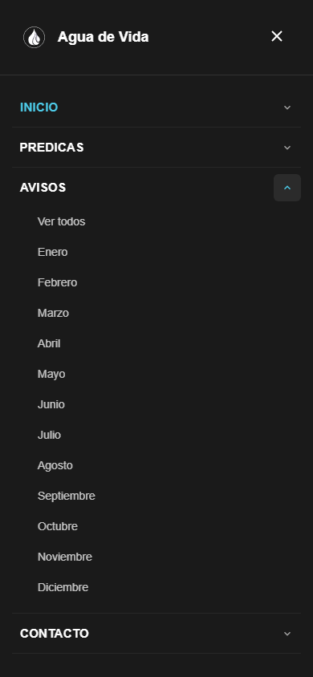

### 4.3 Temas de temporada calendarizados

**Tema Navideño** — banner rojo/verde, navbar y footer recoloreados, copos de nieve
animados cayendo sobre el hero:

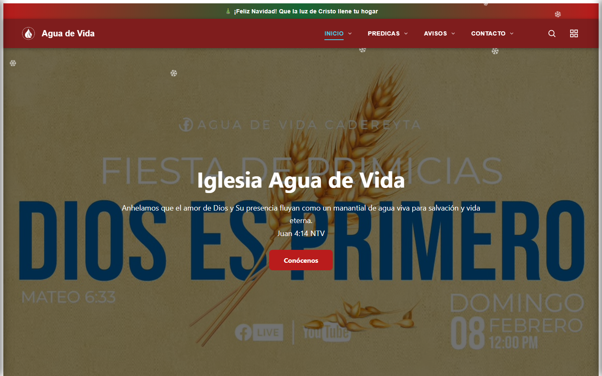

**Tema Independencia (septiembre)** — banner y navbar con los colores de la bandera
de México, franja tricolor en el footer:

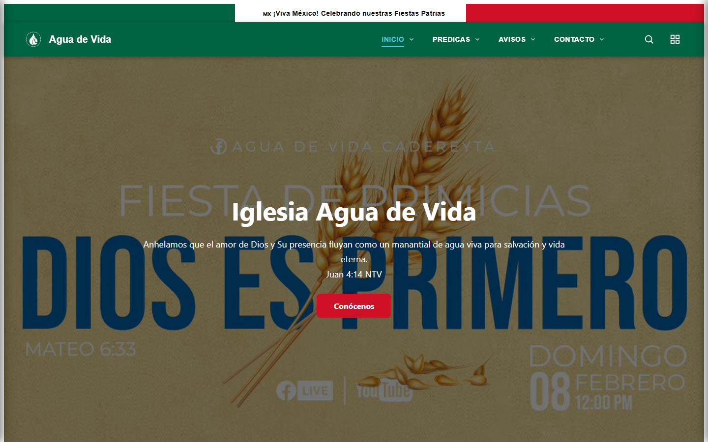

**Tema Normal restaurado** — vuelve exactamente al diseño original:


---

## 5. Archivos nuevos y modificados

**Nuevos:**
- `src/app/services/theme.service.ts`
- `src/app/components/seasonal-overlay/` (`.ts`, `.html`, `.css`)
- `src/app/shared/meses.ts`

**Modificados:**
- `src/app/core/navbar/navbar.ts` / `.html` / `.css` (menú desplegable + hamburguesa)
- `src/app/components/footer/footer.ts` / `.html` / `.css` (botones de temporada)
- `src/app/app.ts` / `.html` (montaje del overlay estacional)
- `src/app/app.config.ts` (scroll a fragmentos)
- `src/styles.css` (estilos globales por tema)
- `src/app/pages/home/home.html` / `.css` (anclas `horarios`, `informacion`)
- `src/app/pages/contacto/contacto.html` / `.css` (anclas `mapa`, `social`, `formulario`)
- `src/app/pages/avisos/avisos.ts` / `.html` / `.css` (filtro por mes)
- `src/app/pages/predicas/predicas.ts` / `.html` / `.css` (filtro por mes)
